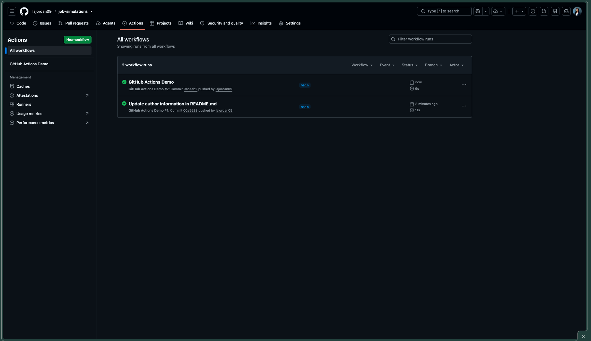
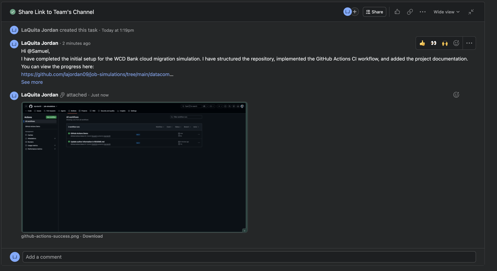
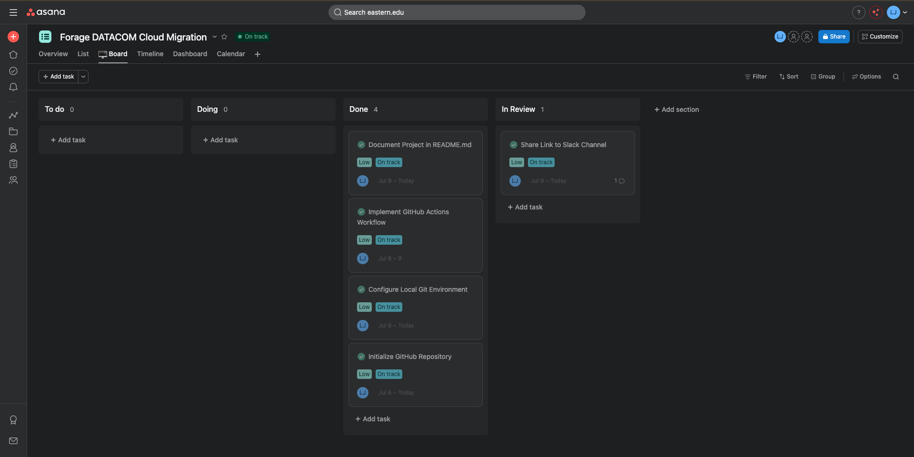

# WCD Bank Cloud Migration Simulation

## Project Overview
This repository serves as a professional simulation of an enterprise cloud migration for **WCD Bank**. As part of a Datacom job simulation, this project demonstrates the technical proficiency required to transition on-premises IT infrastructure to secure, cloud-based environments.

## Technical Tasks
### Task 1: Cloud Application Registration
*   **Objective:** Established secure service principals to enable application-level access within the cloud environment.
*   **Key Focus:** IAM configuration and ensuring Principle of Least Privilege (PoLP).

### Task 2: CI/CD Automation via GitHub Actions
*   **Objective:** Automated the deployment pipeline for WCD Bank applications to ensure consistent infrastructure updates.
*   **Workflow Logic:** Utilized GitHub Actions to trigger automated validation steps upon each push to the `main` branch.
*   **Key Skills:** YAML configuration, Environment Variable management, and Secret injection.

## Project Structure
- `.github/workflows/`: Contains the automated CI/CD pipeline logic.
- `assets/`: Contains documentation images and project evidence.

## Skills Demonstrated
- **Version Control:** Git workflow management.
- **DevOps:** CI/CD pipeline design and execution.
- **Security:** Secure handling of environment variables and access keys.
- **System Migration:** Translating legacy on-prem processes to cloud-native workflows.

---

## Simulation Deliverables
*This section provides evidence of project management and team communication throughout the migration simulation.*

<!-- test trigger -->

### CI/CD Pipeline Success
*Verification of the automated GitHub Actions workflow execution.*

### Communication Log
*Simulated status update posted to the team's Slack channel.*

### Task Management
*Workflow lifecycle tracked using Asana Kanban methodology.*

---

## Author
**LaQuita Jordan**  
Data Analytics Graduate Student  
*Focus: Systems Administration, Cloud Infrastructure & AI Engineering*  
*Developed as part of the DATACOM Job Simulation.*
