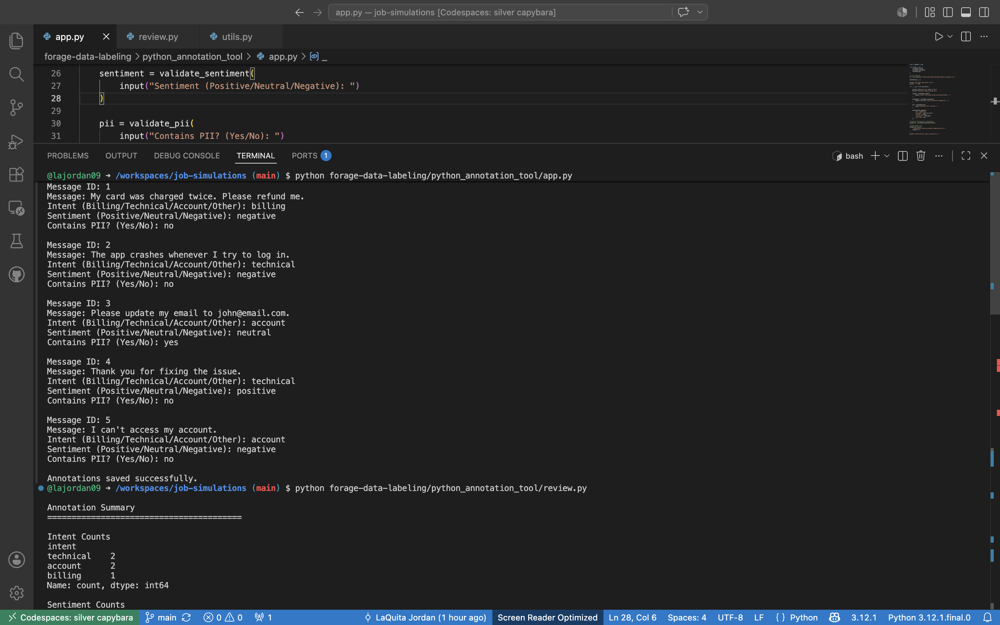

# AI Data Annotation Tool

## Overview

This project began as a simple data-labeling simulation and evolved into a Python-based AI Data Annotation Tool.

The application allows a human annotator to review customer support messages and assign structured labels including:

- Intent Classification
- Sentiment Analysis
- PII Detection

The labeled data is exported to CSV format and can be used as training data for machine learning and natural language processing (NLP) workflows.

This project demonstrates practical experience with:

- Python
- Pandas
- Data Annotation
- Data Validation
- CSV Processing
- Data Quality Review Workflows

---

## Business Problem

Organizations rely on high-quality labeled data to train AI and machine learning models. However, raw customer support messages are unstructured, inconsistent, and may contain sensitive information.

This project addresses the challenge of transforming unstructured customer communications into structured, machine-learning-ready datasets by:

- Classifying customer requests by intent
- Identifying customer sentiment
- Detecting personally identifiable information (PII)
- Applying quality assurance standards to improve annotation consistency

The resulting labeled data can be used to train customer support AI systems, improve operational reporting, and support responsible AI development.
This project simulates the work performed by AI Trainers, Data Annotators, and Human-in-the-Loop reviewers who create high-quality training datasets.

---
## Solution

To address this challenge, I developed a Python-based annotation workflow that converts unstructured customer support messages into structured datasets suitable for AI training and analysis.

The workflow:

1. Loads customer support messages from a CSV dataset
2. Presents messages for annotation
3. Allows classification of Intent, Sentiment, and PII
4. Applies standardized labeling guidelines
5. Exports annotations into a structured dataset
6. Supports downstream quality assurance review processes

The workflow helps ensure consistency, privacy awareness, and data quality throughout the annotation process.

---

## Annotation Schema

### Intent Categories

- Billing
- Technical
- Account
- Other

### Sentiment Categories

- Positive
- Neutral
- Negative

### PII Categories

- Yes
- No
---

## Project Structure

```text
forage-data-labeling/
│
├── data/
│   └── sample_messages.csv
│
├── outputs/
│   └── labeled_data.csv
│
├── python_annotation_tool/
│   ├── app.py
│   ├── review.py
│   ├── utils.py
│   └── requirements.txt
│
├── screenshots/
│   └── v1-1-annotation-workflow.png
│
└── README.md
```

---

### Annotation Workflow

The application loads customer messages from a CSV file and prompts the user to label:

- Intent
  - Billing
  - Technical
  - Account
  - Other

- Sentiment
  - Positive
  - Neutral
  - Negative

- PII Detection
  - Yes
  - No

The completed annotations are exported to:

```text
outputs/labeled_data.csv
```

---

### Validation Layer (Version 1.1)

Validation functions were added to improve data quality.

The system validates:

- Intent values
- Sentiment values
- PII values

Invalid entries are automatically replaced with default values.

This simulates real-world annotation quality controls used in AI training pipelines.

---

### Review Workflow (Version 1.1)

A review utility was added to generate annotation summaries.

The review process calculates:

- Intent counts
- Sentiment counts
- PII counts

This allows a reviewer to quickly assess the quality and distribution of labels within the dataset.

---

## Example Workflow

### Run Annotation Tool

```bash
python forage-data-labeling/python_annotation_tool/app.py
```

### Run Review Tool

```bash
python forage-data-labeling/python_annotation_tool/review.py
```

---
## Workflow Process

### Step 1: Data Ingestion

Customer support messages are loaded from a CSV file.

### Step 2: Annotation

Each message is reviewed and assigned:

- Intent
- Sentiment
- PII Flag

### Step 3: Validation

Annotations are checked against predefined labeling guidelines to promote consistency.

### Step 4: Export

Completed annotations are exported to a structured CSV dataset for downstream use.

### Step 5: Quality Review

Annotations can be reviewed using a Keep / Fix / Flag process to identify inconsistencies and improve overall dataset quality.

---

## Example Input

```csv
id,message
1,"My card was charged twice."
2,"Please change my email to john@email.com"
3,"The app keeps crashing."
4,"Thank you, that fixed it!"
```

---

## Example Output

```csv
id,intent,sentiment,pii_flag
1,Billing,Negative,No
2,Account,Neutral,Yes
3,Technical,Negative,No
4,Other,Positive,No
```

---

## Results

Successfully transformed raw customer support messages into structured datasets containing:

- Intent labels
- Sentiment labels
- PII indicators

The resulting data can be used for:

- AI model training
- Customer support automation
- Sentiment analysis
- Operational reporting
- Data quality monitoring
- Human-in-the-loop AI workflows

This project demonstrates how structured annotation workflows improve data quality and create reliable datasets for machine learning applications.

---

## Screenshot

### Annotation and Review Workflow



---

## Sample Output

```text
Intent Counts

technical    2
account      2
billing      1

Sentiment Counts

negative     3
neutral      1
positive     1

PII Counts

no           4
yes          1
```

---

## Skills Demonstrated

- Python Programming
- Data Annotation
- Data Validation
- Data Quality Review
- CSV Processing
- Pandas
- Human-in-the-Loop AI Workflows
- Natural Language Processing (NLP) Foundations

---

## Version History

### Version 1.0

- Built annotation workflow
- Loaded messages from CSV
- Captured intent, sentiment, and PII labels
- Exported labeled dataset to CSV

### Version 1.1

- Added validation functions
- Added review workflow
- Added annotation summary reporting
- Improved data quality controls

---

## Future Enhancements

Potential future improvements include:

- Confidence scoring
- Multiple annotator support
- Label agreement analysis
- Dashboard reporting with Power BI
- Machine learning model integration
- Web-based annotation interface

---

## Author
```
**LaQuita Jordan**
Data Analytics Graduate Student | AI, Python, & Data Projects Portfolio

GitHub Repository: job-simulations
```
